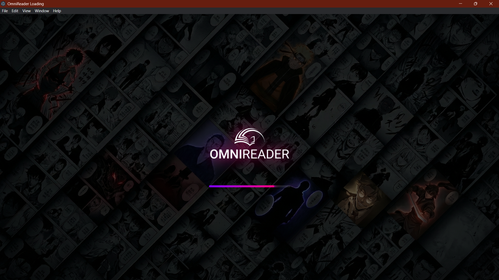
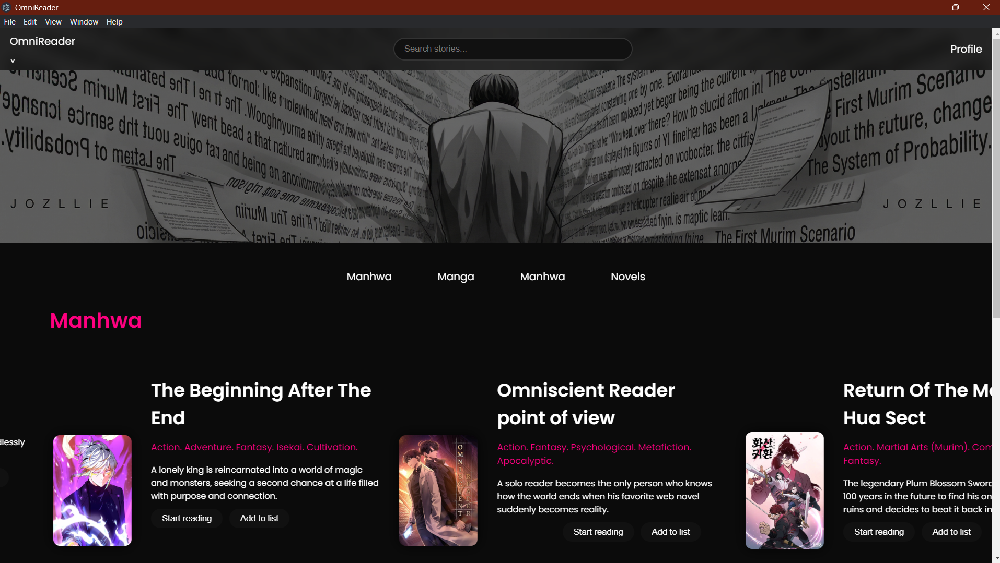

# Omni-Reader 📚

A web-based platform for reading manga, manhwa, manhua, and novels with a modern dark-themed UI.

---

## 🚀 Features
- 📖 Smooth reading experience
- 🌙 Dark theme UI
- 🔄 Infinite scrolling
- ⚡ Fast navigation

---

## 🛠 Tech Stack
- HTML
- CSS
- JavaScript

---

## 📸 Screenshots

.png)

---

## ▶️ How to Run
1. Download or clone this repo
2. Open `loding.html` in browser

---

## 🌐 Live Demo
(Will add soon)
